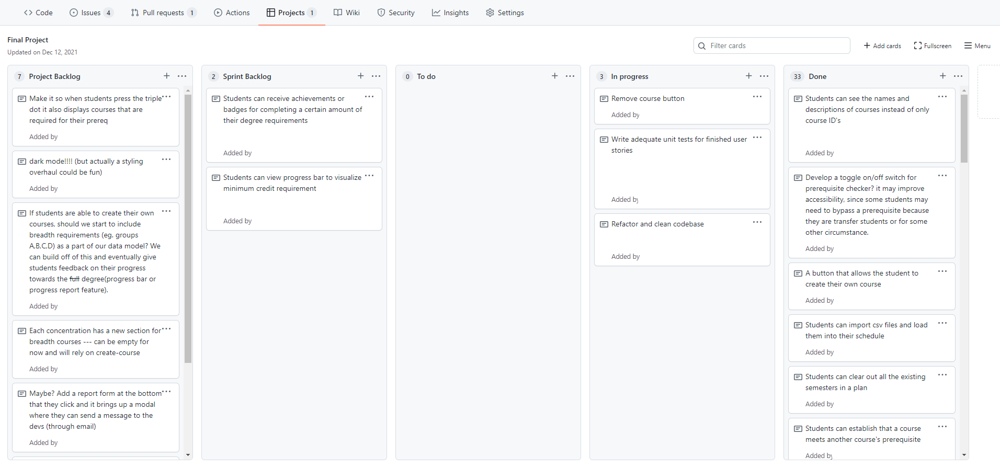

---
waltz:
  title: Final Project Setup
  resource: assignment
  url: https://udel.instructure.com/courses/1631620/assignments/9887351
  published: true
  settings:
    points_possible: 10.0
    grading_type: pass_fail
    submission:
      submission_types:
      - online_text_entry
    timing:
      due_at: April 05 2022, 1159 PM
      unlock_at: April 04 2022, 1200 AM
      lock_at: ''
    secrecy:
      anonymize_students: false
      anonymous_grading: false
---
To begin the [Final Project,](Final Project Description.md) complete all of the following instructions. Failure to follow any of the instructions will lead to an incomplete for this assignment.

There are a series of questions below in numbered bullet points. Your submission for this assignment must have an answer
for each numbered question.

Only one person needs to submit this assignment. Coordinate carefully with your teammates!

Your final teammates are not necessarily the same as the ones you had before. Check your FINAL final project team
instead of the Preliminary final project team.

### Meet Your Teammates

By now, Dr. Bart has put you into your FINAL Final Project teams.

Then, start coordinating with your teammates to answer the following:

  1. How will you communicate with your teammates? 
    * For example, you could use Discord, or Gmail Chat, or any other messaging service. Choose a platform that you all find agreeable and provides instant messaging - email is not sufficient for coding projects.
  2. When and where will you meet on your own outside of class? 
    * Decide whether you want to meet in-person or on Zoom
    * You might want to share your class schedules to facilitate finding a time.
    * You will at least be meeting in lab once a week.
    * You will need to regularly meet multiple times a week outside of class

### Join Your Team

Use the following link to create or join your Team's Final Project repository on GitHub Classroom:
<https://classroom.github.com/a/dJ_7XY4K>

Once you've found your name in the list and identified yourself, check to see if your team already exists. If you are
the first member of your team to access the site, you will need to create your Team. **Please make sure you name your
team like "Team 7" or "Team 19".** Just the word "Team" followed by the Canvas group number of your team (which will be
in your email).

Answer the following question for this submission:

  3. What is the URL of your github repository?

### Deploy to Github Pages

One member of your team needs to set up a Personal Access Token and Repository Secret. Follow the instructions in your project repository's README.md file to learn how to do this (they are the same [as the instructions](https://frontend-fun.github.io/react-hooks-typescript-tome/1-setup/environment.html#setup-personal-access-key){: .inline_disabled} we used earlier in the semester with the tasks). When you correctly deploy the application, you should have a public URL for your website.

  4. What is the URL of your public website?

### Create Project Board

Set up a project board to track work on your project. Go to the "Projects" tab in your repository and click the "Create
a project" button. Name your project board "Final Project" and choose the "Basic Kanban" as the Project Template. Then
click the "Create project" button.

There will be three columns initially (you might need to reload the page to see them). Delete the Cards in the first
column ("To Do") by clicking the three dots in their top-right corner, and choosing "Delete card".

You'll need to create two additional columns using the "Add column" button on the right. Name these two new columns
"Product Backlog" and "Sprint Backlog". Once they are created, drag them both all the way to the left.

During your first Sprint Planning Session, your team will create Notes to populate your Product Backlog. During each
Sprint, you will move Notes from your Product Backlog to your Sprint Backlog. While working on a specific feature, you
will move the Notes over to the "To do" column (after you assign them), and from there over to the "In progress" and
eventually "Done". More information about this process will be given during the first Sprint Planning session.

  5. What is the URL of your project board?

### First Branches and Commits

Everyone should create a new branch to add their names into the site's code, and then merge their branches into the main
branch.

You will need to follow the Github work flow. This means that you do the following steps:

  * Create a local branch named something `acbart-add-name` (the pattern is `username-featurename`)
  * Make your local changes
  * Push your local branch to the remote repository
  * In your browser, navigate to the repository and open a new Pull Request
  * Merge in your change to the main branch

If you are new to using Git Branches, please read over this page, which is a pretty good guide to creating branches and
merging Pull Requests: <https://gist.github.com/vlandham/3b2b79c40bc7353ae95a>

Do not submit this assignment until the live site has all the teammates names!

  6. What are the names of all the members of your team, that we should see on the live site?